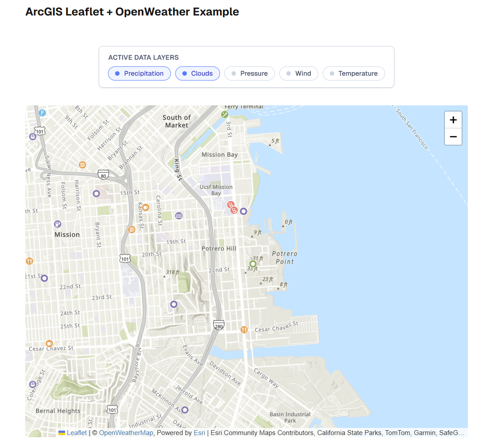

# ArcGIS Leaflet + OpenWeather Map Project

A Next.js application that integrates ArcGIS Location Services with OpenWeatherMap to display interactive maps with weather layers and nearby places information.



## Features

- **Interactive Map**: Powered by Leaflet with ArcGIS vector basemap layers
- **Weather Visualization**: Multiple OpenWeatherMap layers (precipitation, clouds, temperature, etc.)
- **Places Service**: Displays nearby locations using ArcGIS Places API when zoomed in sufficiently
- **Dynamic Layer Control**: Toggle weather layers on/off with a built-in legend

## Prerequisites

- **Node.js** (v18 or higher recommended)
- **npm** package manager
- **API Keys** (see Setup section below)

## API Keys Required

### 1. OpenWeatherMap API Key

**Required for**: Weather layer visualization (precipitation, clouds, temperature, wind speed, pressure)

**How to obtain**:
1. Create a free account at [OpenWeatherMap](https://openweathermap.org/)
2. Navigate to your API keys section
3. Generate a new API key
4. Store this key as `OPENWEATHER_API_KEY` env variable.

**Note**:
- If This key is not present, the app (page) will fail to load
- If the OpenWeatherMap API key is incorrect, the weather map layers will fail to display silently. To debug: Open browser DevTools → Network tab → Look for failed tile requests to `tile.openweathermap.org`

### 2. ArcGIS Location Services API Key

**Required for**:
- Basemap vector tiles (frontend)
- Places Service API (backend)

**How to obtain**:
1. Create a free account at [ArcGIS for Developers](https://developers.arcgis.com/)
2. Go to your [Dashboard](https://developers.arcgis.com/dashboard/)
3. Navigate to "API Keys" section
4. Click "Create API Key"
5. Configure the following services:
    - **Basemap styles service** (for vector basemap layers)
    - **Places service** (for nearby places information)
6. Store this key as `NEXT_PUBLIC_ARCGIS_LOCATION_API_KEY` and `PRIVATE_ARCGIS_LOCATION_API_KEY` env variables.

**Note**:
- **Backend security**: Ideally, use a separate key for Places Service on the backend to keep it secure
- For development/testing, using one key with both permissions is acceptable

## Setup Instructions

Install the dependencies:
```bash
npm install
```

Create a `.env` file in the project root: 
```bash
cp .env.example .env
```

Edit the `.env` file with your API keys as described in the API Keys section.

**Environment Variable Breakdown**:
- `OPENWEATHER_API_KEY`: Server-side only, used to generate weather layer URLs
- `NEXT_PUBLIC_ARCGIS_LOCATION_API_KEY`: Exposed to browser, used for basemap rendering
- `ARCGIS_LOCATION_API_KEY`: Server-side only, used for Places API requests

## Usage Guide

### Weather Layers

Use the Active Layers Control panel to toggle weather information layers
Available layers:
 - Precipitation - Shows rainfall/snowfall data
 - Clouds - Cloud coverage
 - Temperature - Surface temperature
 - Wind Speed - Wind velocity
 - Pressure - Atmospheric pressure

Layers can be toggled on/off individually
Default active layers: Precipitation and Clouds

Note that the weather features have larger scales, so they may not be visible when zooming in closer.

### Places Service
The Places Service (usePlaces hook and places API) displays nearby points of interest when the map is 
sufficiently zoomed in such that the distance between edges is below 20km. This is a requirement of the 
ArcGIS location services endpoint for places. A message is shown to the user if this limit is exceeded.

#### Behaviour

- Automatically fetches up to 20 nearby places when zoom requirements are met
- Updates automatically when panning or zooming
- Places are displayed as markers on the map if API key for places service is valid and the zoom condition is met
- Error banner appears at the top of the map when the zoom level is too high

> **Note**: - Empty (grey) map is displayed when the API key for base layer is invalid.
